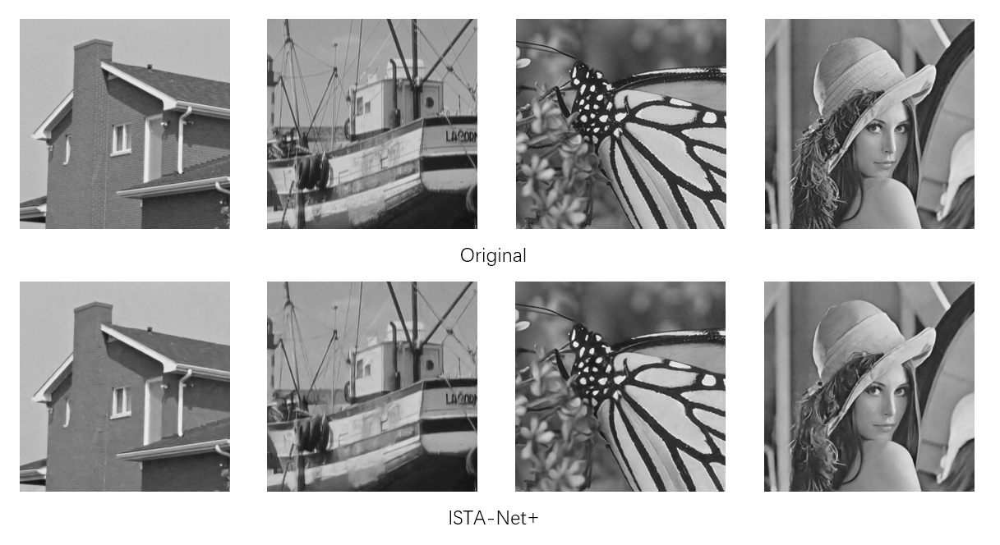

## Optimization-Inspired Compact Deep Compressive Sensing [Tensorflow]

This repository is for OPINE-Net<sup>+</sup> introduced in the following paper

[Jian Zhang](http://jianzhang.tech/), Chen Zhao, Wen Gao "Optimization-Inspired Compact Deep Compressive Sensing", IEEE Journal of Selected Topics in Signal Processing (JSTSP), vol. 14, no. 4, pp.  765-774, May 2020. [[pdf]](https://jianzhang.tech/papers/JSTSP2020-OPINE-Net.pdf)

The code is built on **Tensorflow** and tested on Ubuntu 16.04/18.04 environment (Python2.7, Tensorflow=1.4.1) with 1080Ti GPU.

## Train-CS

### Prepare training data

1. Trainding data (**Training_Data.mat** including 88912 image blocks) is in './data'. If not, please download it from [GoogleDrive](https://drive.google.com/file/d/14CKidNsC795vPfxFDXa1FH9QuNJKE3cp/view?usp=sharing) or [BaiduPan [code: xy52]](https://pan.baidu.com/s/1X3pERjCD37YdqQuzKNXejA).

2. Place **Training_Data.mat** in './data' directory

3. run the following scripts to convert Training_Data.mat to tfrecord

   ```bash
   cd data & python covert_mat_to_tfrecord.py
   ```

### Begin to train

1. run the following scripts to train .

   ```bash
   python train.py --cs_ratio=50 --layer_num=9  --learning_rate=1e-4
   ```

## Test-CS

1. models have been put in './model'.

2. Run the following scripts to test OPINE-Net<sup>+</sup> model which has been supplied.

   ```bash
   # because images in Set11 have different shape,there is need to run different shape's scripts and sum the result in the end. 
   python test.py --test_imgae_width=256
   python test.py --test_image_width=512
   ```


3. sum the PSNR/SSIM of two results above

### The whole test pipeline

1. Prepare test data.

   The original test set11 is in './data'

2. Run the test scripts. 

   See **Quick start**

3. Check the results in './result'.

## Result

### Quantitative Result

```
PSNR/SSIM：31.74/0.9144
```

### Visual Result



## Reference

[OPINE-Net](https://github.com/jianzhangcs/OPINE-Net)